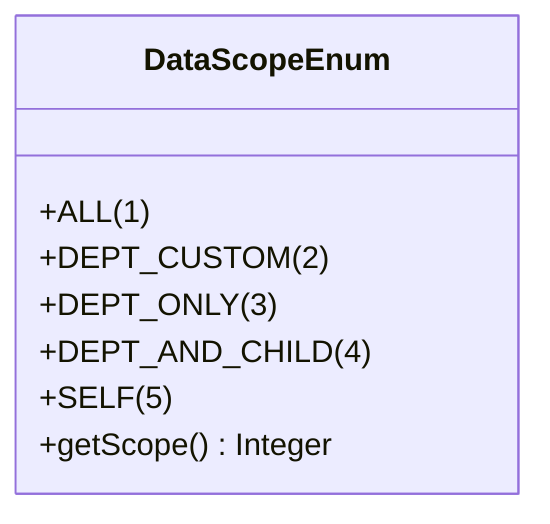
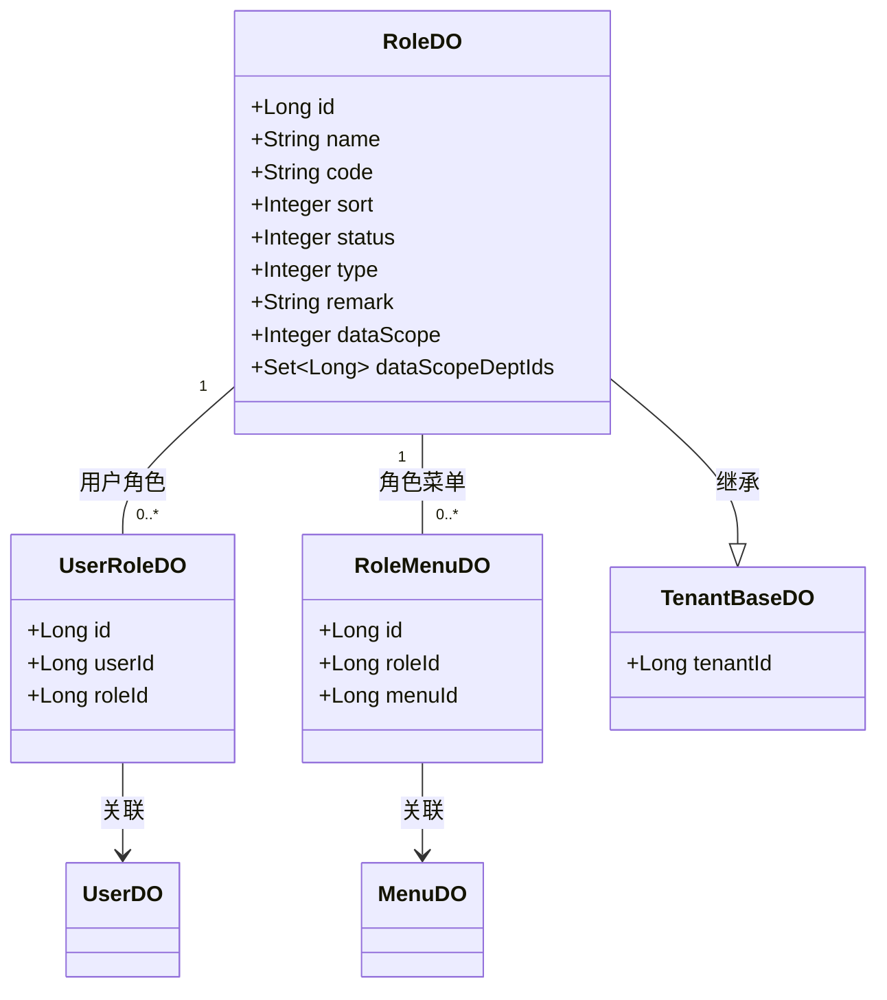

# 角色数据模型

<cite>
**本文档引用的文件**  
- [RoleDO.java](file://yudao-module-system/src/main/java/cn/iocoder/yudao/module/system/dal/dataobject/permission/RoleDO.java)
- [DataScopeEnum.java](file://yudao-module-system/src/main/java/cn/iocoder/yudao/module/system/enums/permission/DataScopeEnum.java)
- [RoleMenuDO.java](file://yudao-module-system/src/main/java/cn/iocoder/yudao/module/system/dal/dataobject/permission/RoleMenuDO.java)
- [UserRoleDO.java](file://yudao-module-system/src/main/java/cn/iocoder/yudao/module/system/dal/dataobject/permission/UserRoleDO.java)
- [RoleServiceImpl.java](file://yudao-module-system/src/main/java/cn/iocoder/yudao/module/system/service/permission/RoleServiceImpl.java)
- [PermissionServiceImpl.java](file://yudao-module-system/src/main/java/cn/iocoder/yudao/module/system/service/permission/PermissionServiceImpl.java)
- [TenantBaseDO.java](file://yudao-framework/yudao-spring-boot-starter-biz-tenant/src/main/java/cn/iocoder/yudao/framework/tenant/core/db/TenantBaseDO.java)
</cite>

## 目录
1. [引言](#引言)
2. [核心字段详解](#核心字段详解)
3. [数据范围枚举详解](#数据范围枚举详解)
4. [多对多关联关系](#多对多关联关系)
5. [逻辑删除与时间戳处理](#逻辑删除与时间戳处理)
6. [实体关系图](#实体关系图)
7. [业务逻辑中的使用](#业务逻辑中的使用)
8. [结论](#结论)

## 引言
角色数据模型是权限管理系统的核心组成部分，用于定义系统中不同角色的权限配置。该模型通过`RoleDO`实体类实现，包含角色的基本信息、数据权限范围以及与其他实体的关联关系。本文档详细描述了`RoleDO`实体的结构、字段含义、枚举值及其在权限控制中的作用。

**Section sources**
- [RoleDO.java](file://yudao-module-system/src/main/java/cn/iocoder/yudao/module/system/dal/dataobject/permission/RoleDO.java#L21-L77)

## 核心字段详解
`RoleDO`实体类定义了角色的核心属性，每个字段都有明确的业务含义和数据约束。

### 角色ID
- **数据类型**: `Long`
- **约束条件**: 主键，自增
- **业务含义**: 唯一标识一个角色，用于数据库查询和关联操作

### 角色名称
- **数据类型**: `String`
- **约束条件**: 唯一，非空
- **业务含义**: 角色的显示名称，用于用户界面展示

### 角色编码
- **数据类型**: `String`
- **约束条件**: 唯一，非空
- **业务含义**: 角色的唯一标识符，用于程序中权限校验

### 角色排序
- **数据类型**: `Integer`
- **约束条件**: 非空
- **业务含义**: 控制角色在列表中的显示顺序

### 状态
- **数据类型**: `Integer`
- **约束条件**: 枚举值，非空
- **业务含义**: 表示角色的启用状态（启用/禁用）

### 备注
- **数据类型**: `String`
- **约束条件**: 可为空
- **业务含义**: 存储角色的附加说明信息

### 租户ID
- **数据类型**: `Long`
- **约束条件**: 继承自`TenantBaseDO`
- **业务含义**: 支持多租户架构，标识角色所属的租户

**Section sources**
- [RoleDO.java](file://yudao-module-system/src/main/java/cn/iocoder/yudao/module/system/dal/dataobject/permission/RoleDO.java#L30-L75)

## 数据范围枚举详解
`DataScopeEnum`枚举类定义了角色的数据权限范围，是实现数据级别权限控制的核心。

### 枚举值说明
- **全部 (ALL)**: 值为1，表示可以访问系统中所有数据
- **指定部门 (DEPT_CUSTOM)**: 值为2，表示可以访问指定部门的数据
- **本部门 (DEPT_ONLY)**: 值为3，表示只能访问本部门的数据
- **本部门及子部门 (DEPT_AND_CHILD)**: 值为4，表示可以访问本部门及所有子部门的数据
- **仅本人 (SELF)**: 值为5，表示只能访问自己的数据

### 数据权限控制机制
数据范围字段在权限校验过程中起着关键作用。系统根据用户角色的数据范围设置，动态生成数据过滤条件。例如，当角色的数据范围为"本部门"时，所有数据查询都会自动添加部门ID过滤条件。



**Diagram sources**
- [DataScopeEnum.java](file://yudao-module-system/src/main/java/cn/iocoder/yudao/module/system/enums/permission/DataScopeEnum.java#L15-L39)

**Section sources**
- [DataScopeEnum.java](file://yudao-module-system/src/main/java/cn/iocoder/yudao/module/system/enums/permission/DataScopeEnum.java#L15-L39)

## 多对多关联关系
角色实体通过中间表与用户和菜单建立多对多关联关系。

### 角色与用户关联
通过`UserRoleDO`实体建立角色与用户的多对多关系：
- **映射表**: `system_user_role`
- **字段**: `user_id`, `role_id`
- **业务含义**: 表示用户被分配了哪些角色

### 角色与菜单关联
通过`RoleMenuDO`实体建立角色与菜单的多对多关系：
- **映射表**: `system_role_menu`
- **字段**: `role_id`, `menu_id`
- **业务含义**: 表示角色拥有哪些菜单权限

```mermaid
erDiagram
ROLE {
Long id PK
String name
String code
Integer sort
Integer status
Integer type
String remark
Integer dataScope
Set dataScopeDeptIds
Long tenantId
}
USER {
Long id PK
String username
String password
Long deptId
Long tenantId
}
MENU {
Long id PK
String name
String permission
Integer type
Long parentId
Long tenantId
}
ROLE ||--o{ USER_ROLE : "通过"
ROLE ||--o{ ROLE_MENU : "通过"
USER ||--o{ USER_ROLE : "通过"
MENU ||--o{ ROLE_MENU : "通过"
class USER_ROLE {
Long id PK
Long userId FK
Long roleId FK
}
class ROLE_MENU {
Long id PK
Long roleId FK
Long menuId FK
}
```

**Diagram sources**
- [RoleDO.java](file://yudao-module-system/src/main/java/cn/iocoder/yudao/module/system/dal/dataobject/permission/RoleDO.java#L21-L77)
- [UserRoleDO.java](file://yudao-module-system/src/main/java/cn/iocoder/yudao/module/system/dal/dataobject/permission/UserRoleDO.java#L14-L34)
- [RoleMenuDO.java](file://yudao-module-system/src/main/java/cn/iocoder/yudao/module/system/dal/dataobject/permission/RoleMenuDO.java#L14-L34)

**Section sources**
- [RoleDO.java](file://yudao-module-system/src/main/java/cn/iocoder/yudao/module/system/dal/dataobject/permission/RoleDO.java#L21-L77)
- [UserRoleDO.java](file://yudao-module-system/src/main/java/cn/iocoder/yudao/module/system/dal/dataobject/permission/UserRoleDO.java#L14-L34)
- [RoleMenuDO.java](file://yudao-module-system/src/main/java/cn/iocoder/yudao/module/system/dal/dataobject/permission/RoleMenuDO.java#L14-L34)

## 逻辑删除与时间戳处理
角色实体继承自`TenantBaseDO`，实现了多租户和基础审计功能。

### 逻辑删除机制
系统采用逻辑删除而非物理删除，通过`deleted`字段标记删除状态：
- **字段**: `deleted`
- **数据类型**: `Integer`
- **默认值**: 0（未删除）
- **删除值**: 1（已删除）

### 时间戳处理
实体自动维护创建和更新时间戳：
- **创建时间**: `createTime`
- **更新时间**: `updateTime`
- **自动更新**: 由MyBatis Plus框架自动处理

**Section sources**
- [TenantBaseDO.java](file://yudao-framework/yudao-spring-boot-starter-biz-tenant/src/main/java/cn/iocoder/yudao/framework/tenant/core/db/TenantBaseDO.java#L11-L20)

## 实体关系图
以下是角色数据模型的完整类图，展示了实体间的继承和关联关系。



**Diagram sources**
- [RoleDO.java](file://yudao-module-system/src/main/java/cn/iocoder/yudao/module/system/dal/dataobject/permission/RoleDO.java#L21-L77)
- [UserRoleDO.java](file://yudao-module-system/src/main/java/cn/iocoder/yudao/module/system/dal/dataobject/permission/UserRoleDO.java#L14-L34)
- [RoleMenuDO.java](file://yudao-module-system/src/main/java/cn/iocoder/yudao/module/system/dal/dataobject/permission/RoleMenuDO.java#L14-L34)
- [TenantBaseDO.java](file://yudao-framework/yudao-spring-boot-starter-biz-tenant/src/main/java/cn/iocoder/yudao/framework/tenant/core/db/TenantBaseDO.java#L11-L20)

## 业务逻辑中的使用
角色数据模型在权限分配和校验过程中被多个服务层组件使用。

### 权限分配流程
1. **创建角色**: `RoleServiceImpl.createRole()`方法创建新角色
2. **分配菜单**: `PermissionServiceImpl.assignRoleMenu()`方法分配菜单权限
3. **分配用户**: `PermissionServiceImpl.assignUserRole()`方法将角色分配给用户

### 权限校验流程
1. **获取用户角色**: `PermissionServiceImpl.getUserRoleIdListByUserIdFromCache()`
2. **检查角色权限**: `PermissionServiceImpl.hasAnyRoles()`
3. **检查菜单权限**: `PermissionServiceImpl.hasAnyPermissions()`
4. **获取数据权限**: `PermissionServiceImpl.getDeptDataPermission()`

### 缓存机制
系统使用Redis缓存角色信息以提高性能：
- **缓存键**: `ROLE:id`
- **缓存策略**: 查询时自动缓存，更新时自动清除
- **失效机制**: 通过`@CacheEvict`注解维护缓存一致性

**Section sources**
- [RoleServiceImpl.java](file://yudao-module-system/src/main/java/cn/iocoder/yudao/module/system/service/permission/RoleServiceImpl.java#L53-L262)
- [PermissionServiceImpl.java](file://yudao-module-system/src/main/java/cn/iocoder/yudao/module/system/service/permission/PermissionServiceImpl.java#L61-L329)

## 结论
角色数据模型通过`RoleDO`实体实现了完整的角色管理功能，包括基本属性、数据权限控制和多对多关联关系。该模型支持多租户架构，通过`TenantBaseDO`实现租户隔离。数据范围枚举提供了灵活的数据权限控制机制，能够满足不同场景下的权限需求。通过中间表`UserRoleDO`和`RoleMenuDO`，实现了角色与用户、菜单的灵活关联，为系统的权限管理提供了坚实的基础。