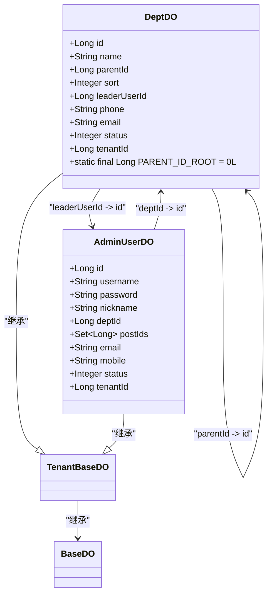

# 部门数据模型

<cite>
**本文档引用的文件**  
- [DeptDO.java](file://yudao-module-system/src/main/java/cn/iocoder/yudao/module/system/dal/dataobject/dept/DeptDO.java)
- [DeptService.java](file://yudao-module-system/src/main/java/cn/iocoder/yudao/module/system/service/dept/DeptService.java)
- [DeptServiceImpl.java](file://yudao-module-system/src/main/java/cn/iocoder/yudao/module/system/service/dept/DeptServiceImpl.java)
- [DeptMapper.java](file://yudao-module-system/src/main/java/cn/iocoder/yudao/module/system/dal/mysql/dept/DeptMapper.java)
- [DataPermissionConfiguration.java](file://yudao-module-system/src/main/java/cn/iocoder/yudao/module/system/framework/datapermission/config/DataPermissionConfiguration.java)
- [AdminUserDO.java](file://yudao-module-system/src/main/java/cn/iocoder/yudao/module/system/dal/dataobject/user/AdminUserDO.java)
</cite>

## 目录
1. [简介](#简介)
2. [核心字段说明](#核心字段说明)
3. [树形层级结构实现](#树形层级结构实现)
4. [与用户实体的关联关系](#与用户实体的关联关系)
5. [逻辑删除与时间戳处理](#逻辑删除与时间戳处理)
6. [数据权限控制机制](#数据权限控制机制)
7. [组织架构管理应用](#组织架构管理应用)
8. [ER图与类图](#er图与类图)

## 简介
部门数据模型是系统组织架构管理的核心组成部分，主要用于构建企业或组织的部门层级结构。该模型通过`DeptDO`实体类实现，支持多级部门嵌套、负责人管理、状态控制等功能，并与用户实体（AdminUserDO）建立关联，为权限控制和数据过滤提供基础支撑。

**Section sources**
- [DeptDO.java](file://yudao-module-system/src/main/java/cn/iocoder/yudao/module/system/dal/dataobject/dept/DeptDO.java)

## 核心字段说明
`DeptDO`实体包含以下核心字段：

- **部门ID (id)**: `Long`类型，主键，唯一标识一个部门。
- **父部门ID (parentId)**: `Long`类型，指向父级部门的ID，根部门的值为0（`PARENT_ID_ROOT`常量）。
- **部门名称 (name)**: `String`类型，部门的名称，具有唯一性约束。
- **显示排序 (sort)**: `Integer`类型，用于控制部门在列表中的显示顺序。
- **负责人 (leaderUserId)**: `Long`类型，关联`AdminUserDO`实体的用户ID，表示该部门的负责人。
- **联系电话 (phone)**: `String`类型，部门的联系电话。
- **邮箱 (email)**: `String`类型，部门的联系邮箱。
- **状态 (status)**: `Integer`类型，表示部门的启用状态，使用`CommonStatusEnum`枚举进行管理（启用/禁用）。
- **租户ID (tenantId)**: `Long`类型，继承自`TenantBaseDO`，用于多租户环境下的数据隔离。

这些字段共同构成了部门的基本信息，支持组织架构的完整表达。

**Section sources**
- [DeptDO.java](file://yudao-module-system/src/main/java/cn/iocoder/yudao/module/system/dal/dataobject/dept/DeptDO.java)

## 树形层级结构实现
部门的树形结构通过`parentId`字段实现。每个部门记录其父部门的ID，形成父子关系链。根部门的`parentId`为0。

### 递归查询实现
`DeptServiceImpl`中的`getChildDeptList`方法通过循环递归的方式查询所有子部门：
1. 从指定的父部门ID开始
2. 查询该层级的所有直接子部门
3. 将子部门ID作为新的父ID，继续查询下一层级
4. 重复步骤2-3，直到没有更多子部门
5. 使用`Short.MAX_VALUE`作为循环上限，防止无限循环

此方法确保能够获取指定部门下的完整子树结构。

### 环路校验
为防止形成部门环路（如A是B的父部门，B又是A的父部门），系统在更新部门时会执行`validateParentDept`方法进行递归校验，确保父部门链中不包含当前部门自身。

**Section sources**
- [DeptServiceImpl.java](file://yudao-module-system/src/main/java/cn/iocoder/yudao/module/system/service/dept/DeptServiceImpl.java#L186-L203)
- [DeptServiceImpl.java](file://yudao-module-system/src/main/java/cn/iocoder/yudao/module/system/service/dept/DeptServiceImpl.java#L116-L149)

## 与用户实体的关联关系
部门实体与用户实体（`AdminUserDO`）存在明确的关联关系：

- **一对多关系**: 一个部门可以有多个用户，通过`AdminUserDO`中的`deptId`字段关联。
- **负责人关联**: 部门的`leaderUserId`字段指向`AdminUserDO`的`id`，表示该部门的负责人。

在实际应用中，如`UserController`获取用户列表时，会通过`deptService.getDeptMap`方法批量获取部门信息，实现用户与部门数据的关联展示。

**Section sources**
- [DeptDO.java](file://yudao-module-system/src/main/java/cn/iocoder/yudao/module/system/dal/dataobject/dept/DeptDO.java#L49)
- [AdminUserDO.java](file://yudao-module-system/src/main/java/cn/iocoder/yudao/module/system/dal/dataobject/user/AdminUserDO.java#L35)

## 逻辑删除与时间戳处理
本系统未采用传统的逻辑删除模式（如`is_deleted`字段），而是通过`status`字段实现软性状态控制。部门被"删除"时实际上是将其状态设置为禁用，保留历史数据完整性。

时间戳处理方面，`DeptDO`继承自`TenantBaseDO`，而`TenantBaseDO`又继承自`BaseDO`（未在搜索结果中显示），通常包含`createTime`和`updateTime`等时间戳字段，用于记录数据的创建和更新时间。

**Section sources**
- [DeptDO.java](file://yudao-module-system/src/main/java/cn/iocoder/yudao/module/system/dal/dataobject/dept/DeptDO.java#L63)
- [TenantBaseDO.java](file://yudao-framework/yudao-spring-boot-starter-biz-tenant/src/main/java/cn/iocoder/yudao/framework/tenant/core/db/TenantBaseDO.java#L11-L20)

## 数据权限控制机制
系统通过`DataPermission`注解和`DataPermissionRule`实现数据权限控制。在`DataPermissionConfiguration`中配置了部门相关的数据权限规则：

- **部门数据权限**: 自动为查询添加部门过滤条件
- **用户数据权限**: 基于用户所属部门进行数据过滤

`DeptService`中的方法如`getChildDeptIdListFromCache`使用`@DataPermission(enable = false)`注解临时禁用数据权限，确保缓存数据的完整性。

**Section sources**
- [DataPermissionConfiguration.java](file://yudao-module-system/src/main/java/cn/iocoder/yudao/module/system/framework/datapermission/config/DataPermissionConfiguration.java#L16-L25)
- [DeptServiceImpl.java](file://yudao-module-system/src/main/java/cn/iocoder/yudao/module/system/service/dept/DeptServiceImpl.java#L210-L216)

## 组织架构管理应用
`DeptService`为组织架构管理提供了完整的API支持：

- **创建部门**: `createDept`方法，自动处理根部门设置和各种校验
- **更新部门**: `updateDept`方法，包含完整性校验
- **删除部门**: `deleteDept`方法，确保无子部门时才可删除
- **查询部门**: 提供多种查询方式，包括单个查询、列表查询、子部门查询等

这些服务被`DeptController`和`DeptApiImpl`封装为REST API，供前端界面和外部系统调用，实现完整的部门管理功能。

**Section sources**
- [DeptService.java](file://yudao-module-system/src/main/java/cn/iocoder/yudao/module/system/service/dept/DeptService.java)
- [DeptServiceImpl.java](file://yudao-module-system/src/main/java/cn/iocoder/yudao/module/system/service/dept/DeptServiceImpl.java)

## ER图与类图

**Diagram sources**
- [DeptDO.java](file://yudao-module-system/src/main/java/cn/iocoder/yudao/module/system/dal/dataobject/dept/DeptDO.java)
- [AdminUserDO.java](file://yudao-module-system/src/main/java/cn/iocoder/yudao/module/system/dal/dataobject/user/AdminUserDO.java)