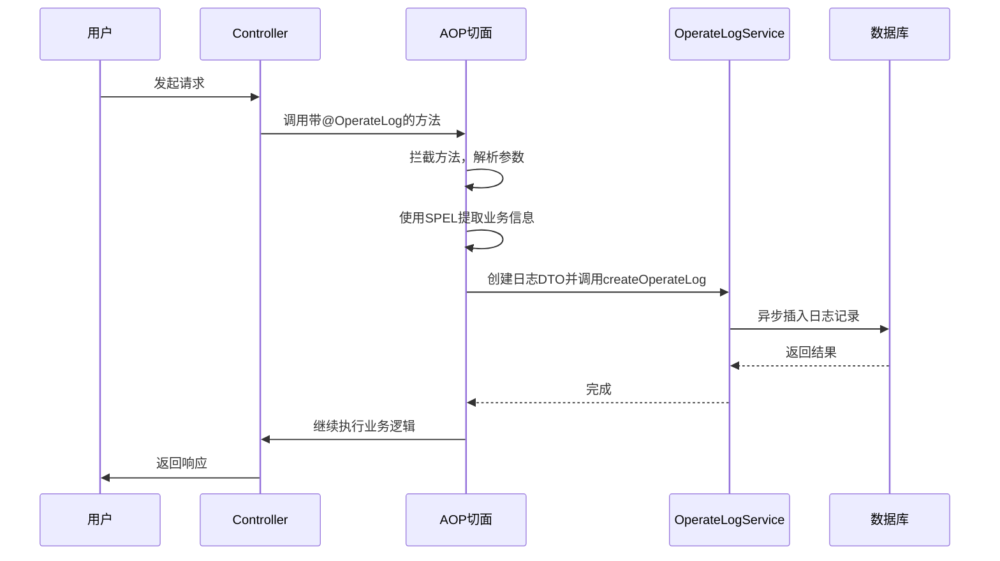
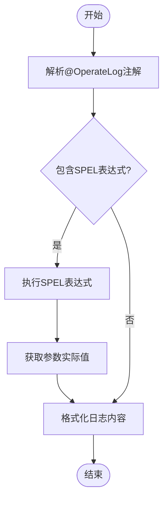
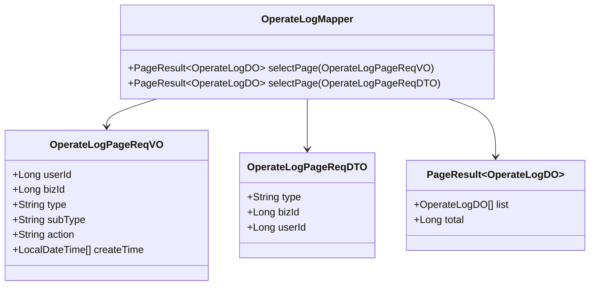
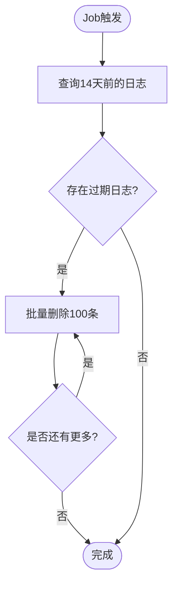

# 操作日志

<cite>
**本文档引用文件**  
- [OperateLogService.java](file://yudao-module-system/src/main/java/cn/iocoder/yudao/module/system/service/logger/OperateLogService.java)
- [OperateLogDO.java](file://yudao-module-system/src/main/java/cn/iocoder/yudao/module/system/dal/dataobject/logger/OperateLogDO.java)
- [AccessLogCleanJob.java](file://yudao-module-infra/src/main/java/cn/iocoder/yudao/module/infra/job/logger/AccessLogCleanJob.java)
- [LogRecordServiceImpl.java](file://yudao-framework/yudao-spring-boot-starter-security/src/main/java/cn/iocoder/yudao/framework/operatelog/core/service/LogRecordServiceImpl.java)
- [YudaoOperateLogConfiguration.java](file://yudao-framework/yudao-spring-boot-starter-security/src/main/java/cn/iocoder/yudao/framework/operatelog/config/YudaoOperateLogConfiguration.java)
- [OperateLogPageReqVO.java](file://yudao-module-system/src/main/java/cn/iocoder/yudao/module/system/controller/admin/logger/vo/operatelog/OperateLogPageReqVO.java)
- [OperateLogPageReqDTO.java](file://yudao-module-system/src/main/java/cn/iocoder/yudao/module/system/api/logger/dto/OperateLogPageReqDTO.java)
- [OperateLogMapper.java](file://yudao-module-system/src/main/java/cn/iocoder/yudao/module/system/dal/mysql/logger/OperateLogMapper.java)
</cite>

## 目录
1. [简介](#简介)
2. [操作日志记录流程](#操作日志记录流程)
3. [OperateLogDO 数据模型](#operatelogdo-数据模型)
4. [@OperateLog 注解使用方法](#operateLog-注解使用方法)
5. [日志内容动态解析机制](#日志内容动态解析机制)
6. [操作日志查询接口与分页机制](#操作日志查询接口与分页机制)
7. [自定义操作日志记录扩展方法](#自定义操作日志记录扩展方法)
8. [日志清理 Job 配置与执行策略](#日志清理-job-配置与执行策略)
9. [代码示例：业务方法中使用操作日志](#代码示例业务方法中使用操作日志)

## 简介
操作日志模块用于记录系统中关键业务操作的详细信息，包括操作人、操作时间、操作类型、操作内容等。该模块通过 AOP 切面自动捕获 Controller 方法调用，结合注解和 SPEL 表达式实现灵活的日志记录。日志数据存储于 `system_operate_log` 表中，并提供分页查询接口和定时清理机制。

**Section sources**
- [OperateLogService.java](file://yudao-module-system/src/main/java/cn/iocoder/yudao/module/system/service/logger/OperateLogService.java#L1-L10)
- [OperateLogDO.java](file://yudao-module-system/src/main/java/cn/iocoder/yudao/module/system/dal/dataobject/logger/OperateLogDO.java#L1-L10)

## 操作日志记录流程
操作日志的记录流程基于 AOP（面向切面编程）实现，通过拦截带有特定注解的方法调用，自动收集参数、执行结果和上下文信息，并生成操作日志。

流程如下：
1. 用户发起 HTTP 请求，调用 Controller 中的方法。
2. AOP 切面检测到方法上存在 `@OperateLog` 注解。
3. 切面拦截方法执行，获取方法参数、用户身份、请求信息等上下文。
4. 使用 SPEL 表达式从方法参数中提取业务信息（如 bizId、action）。
5. 构造 `OperateLogCreateReqDTO` 对象，填充日志内容。
6. 调用 `OperateLogService.createOperateLog()` 异步保存日志到数据库。

该机制实现了非侵入式日志记录，无需在业务代码中显式调用日志记录方法。



**Diagram sources**
- [LogRecordServiceImpl.java](file://yudao-framework/yudao-spring-boot-starter-security/src/main/java/cn/iocoder/yudao/framework/operatelog/core/service/LogRecordServiceImpl.java#L35-L90)
- [OperateLogService.java](file://yudao-module-system/src/main/java/cn/iocoder/yudao/module/system/service/logger/OperateLogService.java#L15-L20)

## OperateLogDO 数据模型
`OperateLogDO` 是操作日志的数据对象，映射数据库表 `system_operate_log`，包含操作的完整上下文信息。

### 字段含义
| 字段名 | 类型 | 说明 |
|--------|------|------|
| id | Long | 日志主键，自增 |
| traceId | String | 链路追踪编号，用于关联分布式调用链 |
| userId | Long | 操作用户编号 |
| userType | Integer | 用户类型（管理员、会员等） |
| type | String | 操作模块类型（如“用户管理”） |
| subType | String | 操作名（如“创建用户”） |
| bizId | Long | 操作模块业务编号（如用户ID） |
| action | String | 操作内容描述 |
| extra | String | 拓展字段，JSON格式 |
| requestMethod | String | 请求方法（GET/POST等） |
| requestUrl | String | 请求地址 |
| userIp | String | 用户IP地址 |
| userAgent | String | 浏览器UA信息 |

### 索引设计
数据库表基于 `id` 字段建立主键索引，同时对 `userId`、`bizId`、`type`、`createTime` 等常用查询字段建立复合索引以提升查询性能。

### 存储策略
- 日志数据持久化存储于 MySQL 数据库。
- 通过 `BaseDO` 继承创建时间、更新时间、软删除等通用字段。
- 支持多租户，通过 `tenant_id` 字段隔离不同租户数据。

**Section sources**
- [OperateLogDO.java](file://yudao-module-system/src/main/java/cn/iocoder/yudao/module/system/dal/dataobject/logger/OperateLogDO.java#L14-L84)
- [BaseDO.java](file://yudao-framework/yudao-spring-boot-starter-mybatis/src/main/java/cn/iocoder/yudao/framework/mybatis/core/dataobject/BaseDO.java#L21-L65)
- [ruoyi-vue-pro.sql](file://sql/mysql/ruoyi-vue-pro.sql#L2579-L2595)

## @OperateLog 注解使用方法
`@OperateLog` 注解用于标记需要记录操作日志的方法，支持模块、操作类型和操作内容的配置。

### 注解属性
- **module**: 操作模块名称（如“用户管理”）
- **operateType**: 操作类型（枚举值：CREATE, UPDATE, DELETE, GET, EXPORT, IMPORT, OTHER）
- **content**: 操作内容模板，支持 SPEL 表达式

### 使用示例
```java
@OperateLog(type = "用户管理", subType = "更新用户", action = "修改用户编号为 #{userId} 的邮箱为 #{email}")
public void updateUser(@RequestParam Long userId, @RequestParam String email) {
    // 业务逻辑
}
```

通过注解配置，可清晰定义每个操作的日志信息，便于后续审计和追溯。

**Section sources**
- [OperateLogDO.java](file://yudao-module-system/src/main/java/cn/iocoder/yudao/module/system/dal/dataobject/logger/OperateLogDO.java#L45-L49)
- [OperateLogDO.java](file://yudao-module-system/src/main/java/cn/iocoder/yudao/module/system/dal/dataobject/logger/OperateLogDO.java#L49-L53)
- [OperateLogDO.java](file://yudao-module-system/src/main/java/cn/iocoder/yudao/module/system/dal/dataobject/logger/OperateLogDO.java#L59-L59)

## 日志内容动态解析机制
系统支持使用 SPEL（Spring Expression Language）表达式从方法参数中动态提取业务信息，实现日志内容的灵活配置。

### 解析流程
1. AOP 切面拦截方法调用，获取方法参数。
2. 解析注解中的 SPEL 表达式（如 `#{userId}`）。
3. 通过 `SpringExpressionUtils.parseExpression()` 执行表达式，获取实际值。
4. 将解析后的值填充到日志内容模板中。

### 自定义解析函数
系统提供 `IParseFunction` 接口，支持自定义解析逻辑。例如：
- `DeptParseFunction`: 根据部门ID解析部门名称
- `BooleanParseFunction`: 将布尔值转换为“是/否”
- `SexParseFunction`: 将性别编码转换为“男/女”

这些函数通过 `@Component` 注册为 Spring Bean，可在 SPEL 中直接调用。



**Diagram sources**
- [LogRecordServiceImpl.java](file://yudao-framework/yudao-spring-boot-starter-security/src/main/java/cn/iocoder/yudao/framework/operatelog/core/service/LogRecordServiceImpl.java#L35-L62)
- [SpringExpressionUtils.java](file://yudao-framework/yudao-common/src/main/java/cn/iocoder/yudao/framework/common/util/spring/SpringExpressionUtils.java#L36-L70)
- [DeptParseFunction.java](file://yudao-module-system/src/main/java/cn/iocoder/yudao/module/system/framework/operatelog/core/DeptParseFunction.java#L0-L46)

## 操作日志查询接口与分页机制
系统提供分页查询接口，支持按用户、业务编号、操作类型等条件筛选日志记录。

### 查询接口
- `getOperateLogPage(OperateLogPageReqVO)`: 管理后台分页查询
- `getOperateLogPage(OperateLogPageReqDTO)`: API 接口分页查询

### 分页机制
- 基于 MyBatis-Plus 的 `PageResult` 实现分页。
- 支持按 `createTime` 范围、`userId`、`bizId`、`type` 等字段过滤。
- 默认按 `id` 降序排列，确保最新日志优先显示。

### 查询条件
| 参数 | 说明 |
|------|------|
| userId | 用户编号 |
| bizId | 业务编号 |
| type | 操作模块（模糊匹配） |
| subType | 操作名（模糊匹配） |
| action | 操作内容（模糊匹配） |
| createTime | 创建时间范围 |



**Diagram sources**
- [OperateLogPageReqVO.java](file://yudao-module-system/src/main/java/cn/iocoder/yudao/module/system/controller/admin/logger/vo/operatelog/OperateLogPageReqVO.java#L0-L34)
- [OperateLogPageReqDTO.java](file://yudao-module-system/src/main/java/cn/iocoder/yudao/module/system/api/logger/dto/OperateLogPageReqDTO.java#L0-L27)
- [OperateLogMapper.java](file://yudao-module-system/src/main/java/cn/iocoder/yudao/module/system/dal/mysql/logger/OperateLogMapper.java#L0-L32)

## 自定义操作日志记录扩展方法
系统支持通过实现 `IParseFunction` 接口扩展日志解析能力，满足复杂业务场景的需求。

### 扩展步骤
1. 创建类实现 `IParseFunction` 接口。
2. 使用 `@Component` 注解注册为 Spring Bean。
3. 实现 `functionName()` 返回函数名。
4. 实现 `apply(Object value)` 方法进行值转换。

### 示例：订单状态解析
```java
@Component
public class OrderStatusParseFunction implements IParseFunction {
    public static final String NAME = "getOrderStatus";

    @Override
    public String functionName() {
        return NAME;
    }

    @Override
    public String apply(Object value) {
        Integer status = Convert.toInt(value);
        return switch (status) {
            case 1 -> "待支付";
            case 2 -> "已支付";
            case 3 -> "已发货";
            default -> "未知";
        };
    }
}
```

在注解中使用：`action = "订单状态变更为 #{getOrderStatus(status)}"`

**Section sources**
- [DeptParseFunction.java](file://yudao-module-system/src/main/java/cn/iocoder/yudao/module/system/framework/operatelog/core/DeptParseFunction.java#L0-L46)
- [BooleanParseFunction.java](file://yudao-module-system/src/main/java/cn/iocoder/yudao/module/system/framework/operatelog/core/BooleanParseFunction.java#L0-L38)
- [IParseFunction.java](file://yudao-framework/yudao-spring-boot-starter-security/src/main/java/cn/iocoder/yudao/framework/operatelog/core/service/LogRecordServiceImpl.java#L35-L62)

## 日志清理 Job 配置与执行策略
系统通过 `AccessLogCleanJob` 定时清理过期的操作日志，避免数据库无限增长。

### Job 配置
- **清理周期**: 每天执行一次
- **保留天数**: 14 天（可通过 `JOB_CLEAN_RETAIN_DAY` 配置）
- **删除条数**: 每次最多删除 100 条（防止数据库压力过大）

### 执行策略
1. Job 触发执行。
2. 调用 `ApiAccessLogService.cleanAccessLog()` 方法。
3. 删除 `create_time` 早于指定天数的日志记录。
4. 分批删除，每次限制条数，避免长时间锁表。

### 配置说明
```java
private static final Integer JOB_CLEAN_RETAIN_DAY = 14;
private static final Integer DELETE_LIMIT = 100;
```

该 Job 实现了 `JobHandler` 接口，由 Quartz 调度框架驱动执行。



**Diagram sources**
- [AccessLogCleanJob.java](file://yudao-module-infra/src/main/java/cn/iocoder/yudao/module/infra/job/logger/AccessLogCleanJob.java#L15-L40)
- [JobHandler.java](file://yudao-framework/yudao-spring-boot-starter-job/src/main/java/cn/iocoder/yudao/framework/quartz/core/handler/JobHandler.java#L7-L18)

## 代码示例：业务方法中使用操作日志
以下示例展示如何在业务方法中使用操作日志功能。

### 示例1：用户更新操作
```java
@OperateLog(type = "用户管理", subType = "更新用户", action = "修改用户 #{getUserById(#userId)} 的邮箱为 #{#email}")
public void updateUser(Long userId, String email) {
    // 更新用户邮箱的业务逻辑
    userService.updateEmail(userId, email);
}
```

### 示例2：订单创建操作
```java
@OperateLog(type = "订单管理", subType = "创建订单", action = "创建订单，金额 #{#order.amount}，用户 #{getUserById(#order.userId)}")
public Order createOrder(Order order) {
    // 创建订单的业务逻辑
    return orderService.create(order);
}
```

### 示例3：数据导出操作
```java
@GetMapping("/export")
@OperateLog(type = "报表管理", subType = "导出报表", operateType = OperateTypeEnum.EXPORT)
public void exportReport(HttpServletResponse response) {
    // 导出报表的业务逻辑
    reportService.export(response);
}
```

通过合理使用 `@OperateLog` 注解和 SPEL 表达式，可实现清晰、可追溯的操作日志记录。

**Section sources**
- [OperateLogController.java](file://yudao-module-system/src/main/java/cn/iocoder/yudao/module/system/controller/admin/logger/OperateLogController.java#L40-L58)
- [OperateLogApiImpl.java](file://yudao-module-system/src/main/java/cn/iocoder/yudao/module/system/api/logger/OperateLogApiImpl.java#L32-L37)
- [OperateLogServiceImpl.java](file://yudao-module-system/src/main/java/cn/iocoder/yudao/module/system/service/logger/OperateLogServiceImpl.java#L28-L32)