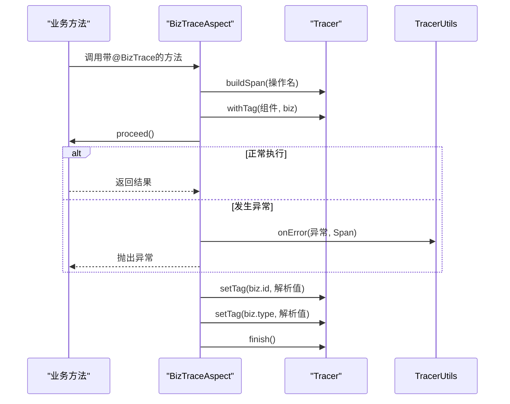
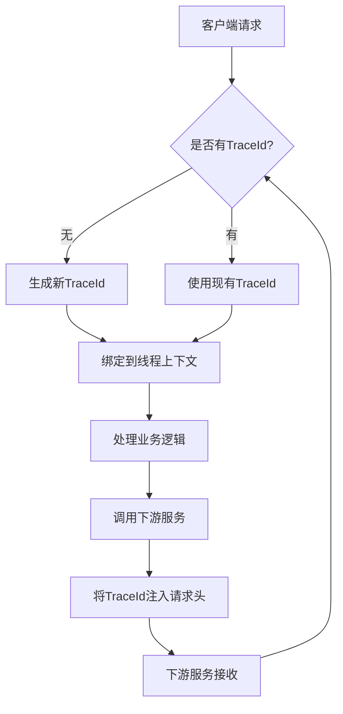

# 日志与监控

<cite>
**本文档引用文件**  
- [OperateLogService.java](file://yudao-module-system/src/main/java/cn/iocoder/yudao/module/system/service/logger/OperateLogService.java)
- [LoginLogService.java](file://yudao-module-system/src/main/java/cn/iocoder/yudao/module/system/service/logger/LoginLogService.java)
- [OperateLogDO.java](file://yudao-module-system/src/main/java/cn/iocoder/yudao/module/system/dal/dataobject/logger/OperateLogDO.java)
- [LoginLogDO.java](file://yudao-module-system/src/main/java/cn/iocoder/yudao/module/system/dal/dataobject/logger/LoginLogDO.java)
- [BizTrace.java](file://yudao-framework/yudao-spring-boot-starter-monitor/src/main/java/cn/iocoder/yudao/framework/tracer/core/annotation/BizTrace.java)
- [BizTraceAspect.java](file://yudao-framework/yudao-spring-boot-starter-monitor/src/main/java/cn/iocoder/yudao/framework/tracer/core/aop/BizTraceAspect.java)
- [TracerUtils.java](file://yudao-framework/yudao-common/src/main/java/cn/iocoder/yudao/framework/common/util/monitor/TracerUtils.java)
- [TracerProperties.java](file://yudao-framework/yudao-spring-boot-starter-monitor/src/main/java/cn/iocoder/yudao/framework/tracer/config/TracerProperties.java)
</cite>

## 目录
1. [引言](#引言)
2. [操作日志实现机制](#操作日志实现机制)
3. [登录日志实现机制](#登录日志实现机制)
4. [基于AOP的自动日志记录](#基于aop的自动日志记录)
5. [链路追踪实现原理](#链路追踪实现原理)
6. [监控指标收集与暴露](#监控指标收集与暴露)
7. [APM工具集成配置](#apm工具集成配置)
8. [日志查询与分析实践](#日志查询与分析实践)
9. [日志脱敏与敏感信息保护](#日志脱敏与敏感信息保护)
10. [总结](#总结)

## 引言
本文档系统性地介绍项目的可观测性实现方案，涵盖操作日志、登录日志、链路追踪和监控指标等核心组件。重点阐述日志收集机制、自动记录实现、追踪原理以及监控体系的构建方式，为系统运维和故障排查提供全面的技术支持。

## 操作日志实现机制

### 日志记录触发条件
操作日志通过业务服务调用触发，主要在用户执行关键操作（如数据增删改查）时由`OperateLogService`接口的`createOperateLog`方法记录。该服务定义了操作日志的创建和分页查询功能。

### 日志内容结构
操作日志的数据结构由`OperateLogDO`类定义，包含以下核心字段：
- **id**: 日志主键
- **traceId**: 链路追踪编号，用于关联分布式调用链
- **userId**: 用户编号
- **userType**: 用户类型（管理员/会员）
- **type**: 操作模块类型
- **subType**: 操作名
- **bizId**: 操作模块业务编号
- **action**: 日志内容，描述具体操作明细
- **extra**: 拓展字段，以JSON格式存储复杂业务信息
- **requestMethod**: 请求方法名
- **requestUrl**: 请求地址
- **userIp**: 用户IP
- **userAgent**: 浏览器UA

### 存储策略
操作日志采用关系型数据库存储，表名为`system_operate_log`。通过MyBatis Plus框架实现数据持久化，支持Oracle、PostgreSQL等多数据库主键自增序列。日志数据与用户操作行为强关联，便于后续审计和分析。

**Section sources**
- [OperateLogService.java](file://yudao-module-system/src/main/java/cn/iocoder/yudao/module/system/service/logger/OperateLogService.java#L1-L40)
- [OperateLogDO.java](file://yudao-module-system/src/main/java/cn/iocoder/yudao/module/system/dal/dataobject/logger/OperateLogDO.java#L1-L86)

## 登录日志实现机制

### 日志记录触发条件
登录日志在用户登录或登出时触发，由`LoginLogService`接口的`createLoginLog`方法记录。该服务负责登录日志的创建和分页查询。

### 日志内容结构
登录日志的数据结构由`LoginLogDO`类定义，包含以下核心字段：
- **id**: 日志主键
- **logType**: 日志类型（登录/登出），枚举`LoginLogTypeEnum`
- **traceId**: 链路追踪编号
- **userId**: 用户编号
- **userType**: 用户类型
- **username**: 用户账号（冗余字段，因账号可变更）
- **result**: 登录结果，枚举`LoginResultEnum`
- **userIp**: 用户IP
- **userAgent**: 浏览器UA

### 存储策略
登录日志存储于`system_login_log`表中，同样使用MyBatis Plus进行数据操作。表结构设计考虑了登录行为的特殊性，区分了登录和登出两种类型，并记录了详细的登录结果状态。

**Section sources**
- [LoginLogService.java](file://yudao-module-system/src/main/java/cn/iocoder/yudao/module/system/service/logger/LoginLogService.java#L1-L31)
- [LoginLogDO.java](file://yudao-module-system/src/main/java/cn/iocoder/yudao/module/system/dal/dataobject/logger/LoginLogDO.java#L1-L73)

## 基于AOP的自动日志记录

### @OperateLog注解使用方式
系统通过自定义注解`@BizTrace`实现业务链路的自动追踪。该注解应用于方法级别，可指定操作名、业务编号和业务类型。

```java
@BizTrace(id = "#id", type = "'Order'", operationName = "订单处理")
public void processOrder(Long id) {
    // 业务逻辑
}
```

### AOP切面实现
`BizTraceAspect`切面类负责处理`@BizTrace`注解，其核心逻辑包括：
1. 使用`@Around`环绕通知拦截带注解的方法
2. 创建OpenTracing Span并设置组件标签
3. 执行原始方法调用
4. 异常情况下调用`TracerFrameworkUtils.onError`处理错误
5. 设置业务相关的tag（biz.id和biz.type）
6. 完成Span并释放资源

切面通过Spring Expression Language（SpEL）解析注解中的表达式，动态获取业务编号和类型值。



**Diagram sources**
- [BizTrace.java](file://yudao-framework/yudao-spring-boot-starter-monitor/src/main/java/cn/iocoder/yudao/framework/tracer/core/annotation/BizTrace.java#L1-L43)
- [BizTraceAspect.java](file://yudao-framework/yudao-spring-boot-starter-monitor/src/main/java/cn/iocoder/yudao/framework/tracer/core/aop/BizTraceAspect.java#L1-L78)

**Section sources**
- [BizTrace.java](file://yudao-framework/yudao-spring-boot-starter-monitor/src/main/java/cn/iocoder/yudao/framework/tracer/core/annotation/BizTrace.java#L1-L43)
- [BizTraceAspect.java](file://yudao-framework/yudao-spring-boot-starter-monitor/src/main/java/cn/iocoder/yudao/framework/tracer/core/aop/BizTraceAspect.java#L1-L78)

## 链路追踪实现原理

### TraceId生成机制
系统集成Apache SkyWalking实现分布式链路追踪。`TracerUtils`工具类提供了获取当前链路追踪编号的静态方法`getTraceId()`，该方法直接调用SkyWalking的`TraceContext.traceId()`获取全局唯一的TraceId。

### 跨服务传播机制
TraceId通过HTTP请求头在服务间传递，遵循OpenTracing标准。`TraceFilter`过滤器负责从请求中提取或生成TraceId，并将其绑定到当前线程上下文。当调用下游服务时，TraceId会自动注入到HTTP请求头中，确保整个调用链的连续性。

### 上下文管理
系统利用SkyWalking的自动探针（Agent）实现无侵入式的链路追踪。对于需要手动控制的场景，可通过`Tracer`实例创建和管理Span，实现细粒度的追踪控制。



**Diagram sources**
- [TracerUtils.java](file://yudao-framework/yudao-common/src/main/java/cn/iocoder/yudao/framework/common/util/monitor/TracerUtils.java#L1-L31)
- [TraceFilter.java](file://yudao-framework/yudao-spring-boot-starter-monitor/src/main/java/cn/iocoder/yudao/framework/tracer/core/filter/TraceFilter.java)

**Section sources**
- [TracerUtils.java](file://yudao-framework/yudao-common/src/main/java/cn/iocoder/yudao/framework/common/util/monitor/TracerUtils.java#L1-L31)

## 监控指标收集与暴露

### 系统性能指标
系统通过Spring Boot Actuator暴露基础性能指标，包括：
- JVM内存使用情况
- 线程状态
- GC统计
- HTTP请求统计
- 数据库连接池状态

### 业务指标
业务指标通过Micrometer框架收集，主要包括：
- 操作日志记录速率
- 登录成功率
- API调用延迟分布
- 业务关键操作频率

### 自定义指标
开发者可通过`MeterRegistry`注册自定义指标，如：
```java
@Value("${yudao.tracer.enabled}")
private boolean tracerEnabled;
```

指标配置在`TracerProperties`类中定义，支持通过配置文件灵活调整。

**Section sources**
- [TracerProperties.java](file://yudao-framework/yudao-spring-boot-starter-monitor/src/main/java/cn/iocoder/yudao/framework/tracer/config/TracerProperties.java#L1-L15)

## APM工具集成配置

### SkyWalking集成
系统默认集成SkyWalking作为APM解决方案，主要配置包括：
1. 在`pom.xml`中引入SkyWalking agent依赖
2. 启动时通过JVM参数指定agent路径
3. 配置`application.yaml`中的追踪相关参数
4. 修改SkyWalking OAP Server的`application.yaml`，在`SW_SEARCHABLE_TAG_KEYS`中添加`biz.type`和`biz.id`

### 配置要点
- 启用/禁用追踪功能：通过`yudao.tracer.enabled`配置项控制
- 采样率设置：平衡性能开销与数据完整性
- 标签扩展：自定义可搜索的业务标签
- 数据上报间隔：调整性能数据上报频率

**Section sources**
- [TracerProperties.java](file://yudao-framework/yudao-spring-boot-starter-monitor/src/main/java/cn/iocoder/yudao/framework/tracer/config/TracerProperties.java#L1-L15)

## 日志查询与分析实践

### 查询接口
系统提供分页查询接口：
- `getOperateLogPage`: 查询操作日志分页
- `getLoginLogPage`: 查询登录日志分页

支持按时间范围、用户、操作类型等条件过滤。

### 分析工具
推荐使用ELK（Elasticsearch, Logstash, Kibana）或SkyWalking UI进行日志分析：
- 通过TraceId关联分布式调用链
- 统计登录失败率趋势
- 分析高频操作模块
- 监控异常日志增长

### 告警策略
建议配置以下告警规则：
- 单位时间内登录失败次数超过阈值
- 关键操作日志缺失
- 链路追踪成功率下降
- 系统错误日志突增

## 日志脱敏与敏感信息保护

### 脱敏机制
系统在日志记录前对敏感信息进行脱敏处理：
- 用户密码：完全屏蔽
- 手机号：中间四位替换为****
- 身份证号：部分字符替换为*
- 邮箱：用户名部分脱敏

### 保护策略
- 敏感字段不在日志中明文记录
- 使用`@Sensitive`注解标记敏感字段
- 在序列化时自动进行脱敏处理
- 访问日志查询接口需权限认证
- 审计日志独立存储并加密

## 总结
本系统构建了完整的可观测性体系，通过操作日志和登录日志实现行为审计，利用AOP和注解实现自动化日志记录，基于SkyWalking提供强大的链路追踪能力。监控指标的收集和告警机制为系统稳定性提供了保障，而日志脱敏策略则确保了用户隐私安全。整体方案兼顾了功能性、性能和安全性，为系统的运维和优化提供了坚实基础。