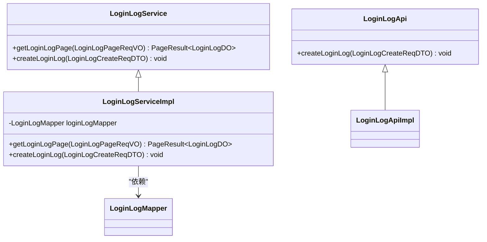
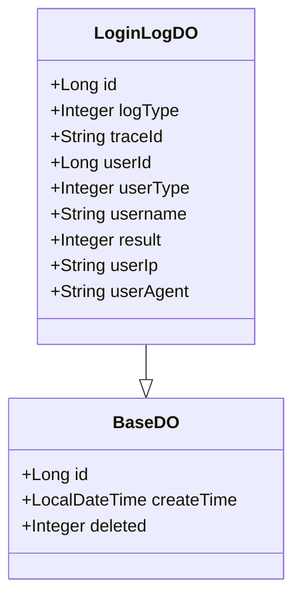
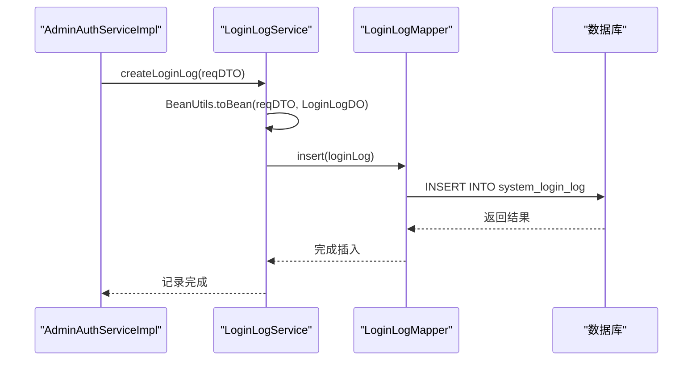
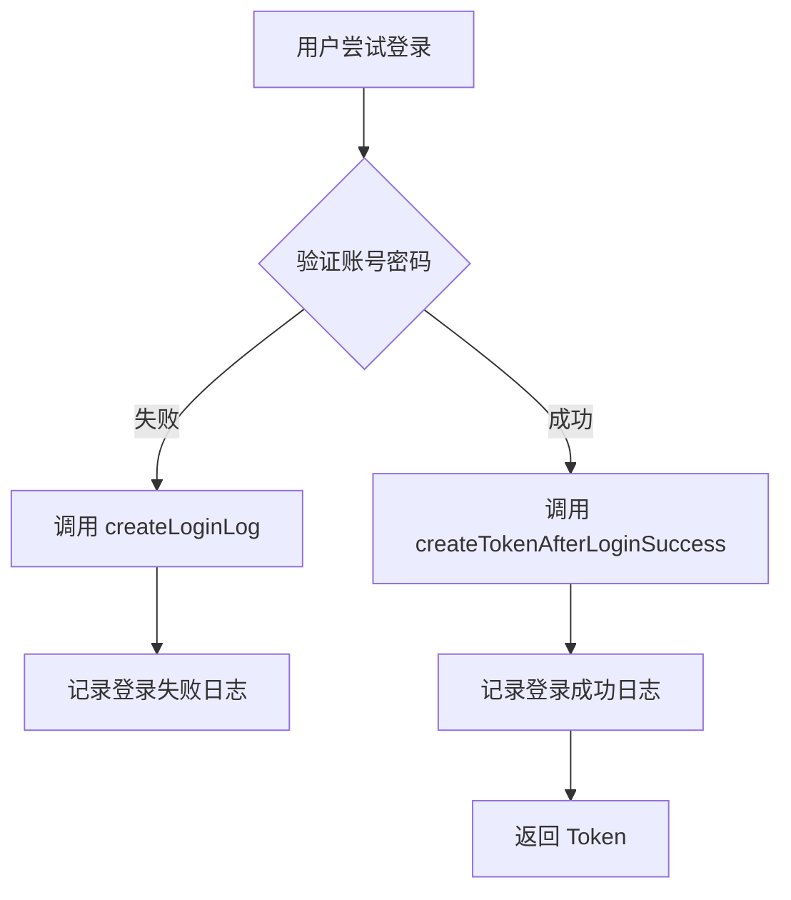
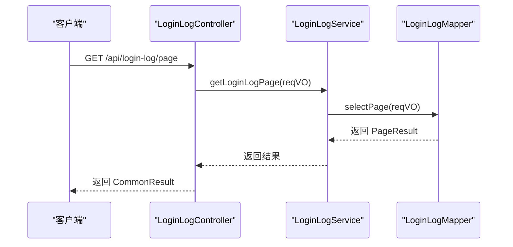
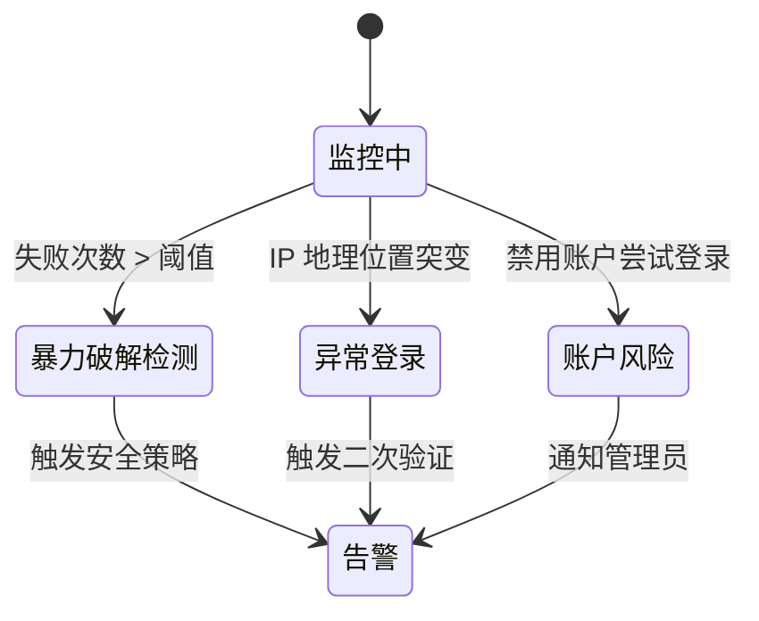

# 登录日志

<cite>
**本文档引用文件**  
- [LoginLogService.java](file://yudao-module-system/src/main/java/cn/iocoder/yudao/module/system/service/logger/LoginLogService.java)
- [LoginLogServiceImpl.java](file://yudao-module-system/src/main/java/cn/iocoder/yudao/module/system/service/logger/LoginLogServiceImpl.java)
- [LoginLogDO.java](file://yudao-module-system/src/main/java/cn/iocoder/yudao/module/system/dal/dataobject/logger/LoginLogDO.java)
- [AdminAuthServiceImpl.java](file://yudao-module-system/src/main/java/cn/iocoder/yudao/module/system/service/auth/AdminAuthServiceImpl.java)
- [LoginLogApi.java](file://yudao-module-system/src/main/java/cn/iocoder/yudao/module/system/api/logger/LoginLogApi.java)
- [LoginLogTypeEnum.java](file://yudao-module-system/src/main/java/cn/iocoder/yudao/module/system/enums/logger/LoginLogTypeEnum.java)
- [LoginResultEnum.java](file://yudao-module-system/src/main/java/cn/iocoder/yudao/module/system/enums/logger/LoginResultEnum.java)
- [LoginLogController.java](file://yudao-module-system/src/main/java/cn/iocoder/yudao/module/system/controller/admin/logger/LoginLogController.java)
- [LoginLogMapper.java](file://yudao-module-system/src/main/java/cn/iocoder/yudao/module/system/dal/mysql/logger/LoginLogMapper.java)
</cite>

## 目录
1. [简介](#简介)
2. [核心功能概述](#核心功能概述)
3. [数据模型设计](#数据模型设计)
4. [日志记录机制](#日志记录机制)
5. [认证流程集成](#认证流程集成)
6. [日志查询与分析](#日志查询与分析)
7. [安全审计价值](#安全审计价值)
8. [日志清理策略](#日志清理策略)
9. [API 统计接口](#api-统计接口)
10. [附录](#附录)

## 简介
登录日志模块用于记录系统中所有用户的登录、登出及登录失败事件，为系统安全审计、行为分析和异常检测提供关键数据支持。该模块通过统一的日志服务接口，实现对多种登录方式（账号密码、短信、社交登录等）的全面覆盖。

**Section sources**
- [LoginLogService.java](file://yudao-module-system/src/main/java/cn/iocoder/yudao/module/system/service/logger/LoginLogService.java)
- [LoginLogDO.java](file://yudao-module-system/src/main/java/cn/iocoder/yudao/module/system/dal/dataobject/logger/LoginLogDO.java)

## 核心功能概述
登录日志服务（LoginLogService）提供两大核心功能：一是创建登录日志记录，二是分页查询日志数据。该服务由 `LoginLogServiceImpl` 实现，并通过 `LoginLogApi` 接口对外暴露，供其他模块调用。

**Diagram sources**
- [LoginLogService.java](file://yudao-module-system/src/main/java/cn/iocoder/yudao/module/system/service/logger/LoginLogService.java)
- [LoginLogServiceImpl.java](file://yudao-module-system/src/main/java/cn/iocoder/yudao/module/system/service/logger/LoginLogServiceImpl.java)
- [LoginLogApi.java](file://yudao-module-system/src/main/java/cn/iocoder/yudao/module/system/api/logger/LoginLogApi.java)

**Section sources**
- [LoginLogService.java](file://yudao-module-system/src/main/java/cn/iocoder/yudao/module/system/service/logger/LoginLogService.java)
- [LoginLogServiceImpl.java](file://yudao-module-system/src/main/java/cn/iocoder/yudao/module/system/service/logger/LoginLogServiceImpl.java)

## 数据模型设计
`LoginLogDO` 是登录日志的数据对象，继承自基础实体类 `BaseDO`，包含以下关键字段：

| 字段名 | 类型 | 说明 |
|--------|------|------|
| id | Long | 日志主键 |
| logType | Integer | 日志类型，见 `LoginLogTypeEnum` 枚举 |
| traceId | String | 链路追踪编号 |
| userId | Long | 用户编号 |
| userType | Integer | 用户类型，见 `UserTypeEnum` 枚举 |
| username | String | 用户账号（冗余字段） |
| result | Integer | 登录结果，见 `LoginResultEnum` 枚举 |
| userIp | String | 用户 IP 地址 |
| userAgent | String | 浏览器 User-Agent 信息 |

**Diagram sources**
- [LoginLogDO.java](file://yudao-module-system/src/main/java/cn/iocoder/yudao/module/system/dal/dataobject/logger/LoginLogDO.java)

**Section sources**
- [LoginLogDO.java](file://yudao-module-system/src/main/java/cn/iocoder/yudao/module/system/dal/dataobject/logger/LoginLogDO.java)

## 日志记录机制
系统在用户进行登录、登出或登录失败时，自动创建相应的日志记录。日志记录流程如下：

1. 构造 `LoginLogCreateReqDTO` 请求对象
2. 调用 `LoginLogService.createLoginLog()` 方法
3. 服务层将 DTO 转换为 `LoginLogDO` 并持久化到数据库

**Diagram sources**
- [AdminAuthServiceImpl.java](file://yudao-module-system/src/main/java/cn/iocoder/yudao/module/system/service/auth/AdminAuthServiceImpl.java)
- [LoginLogServiceImpl.java](file://yudao-module-system/src/main/java/cn/iocoder/yudao/module/system/service/logger/LoginLogServiceImpl.java)
- [LoginLogMapper.java](file://yudao-module-system/src/main/java/cn/iocoder/yudao/module/system/dal/mysql/logger/LoginLogMapper.java)

**Section sources**
- [LoginLogServiceImpl.java](file://yudao-module-system/src/main/java/cn/iocoder/yudao/module/system/service/logger/LoginLogServiceImpl.java)
- [AdminAuthServiceImpl.java](file://yudao-module-system/src/main/java/cn/iocoder/yudao/module/system/service/auth/AdminAuthServiceImpl.java)

## 认证流程集成
`AdminAuthServiceImpl` 是认证服务的实现类，在其多个方法中集成了登录日志记录逻辑：

- `authenticate()`：记录账号密码验证结果
- `login()`：成功登录后记录日志
- `smsLogin()`：短信登录成功后记录
- `socialLogin()`：社交登录成功后记录
- `logout()`：登出时记录日志

例如，在账号密码认证失败时，会调用 `createLoginLog(null, username, LOGIN_USERNAME, BAD_CREDENTIALS)` 记录失败日志。

**Diagram sources**
- [AdminAuthServiceImpl.java](file://yudao-module-system/src/main/java/cn/iocoder/yudao/module/system/service/auth/AdminAuthServiceImpl.java)

**Section sources**
- [AdminAuthServiceImpl.java](file://yudao-module-system/src/main/java/cn/iocoder/yudao/module/system/service/auth/AdminAuthServiceImpl.java)

## 日志查询与分析
系统提供分页查询接口，支持按多种条件筛选登录日志：

- 用户 IP（模糊匹配）
- 用户名（模糊匹配）
- 创建时间范围
- 登录状态（成功/失败）

查询接口由 `LoginLogController` 提供，调用 `LoginLogService.getLoginLogPage()` 方法获取分页结果。

**Diagram sources**
- [LoginLogController.java](file://yudao-module-system/src/main/java/cn/iocoder/yudao/module/system/controller/admin/logger/LoginLogController.java)
- [LoginLogService.java](file://yudao-module-system/src/main/java/cn/iocoder/yudao/module/system/service/logger/LoginLogService.java)
- [LoginLogMapper.java](file://yudao-module-system/src/main/java/cn/iocoder/yudao/module/system/dal/mysql/logger/LoginLogMapper.java)

**Section sources**
- [LoginLogController.java](file://yudao-module-system/src/main/java/cn/iocoder/yudao/module/system/controller/admin/logger/LoginLogController.java)
- [LoginLogMapper.java](file://yudao-module-system/src/main/java/cn/iocoder/yudao/module/system/dal/mysql/logger/LoginLogMapper.java)

## 安全审计价值
登录日志在安全审计中具有重要价值：

- **暴力破解检测**：通过分析同一 IP 或用户在短时间内大量失败登录尝试
- **异常登录行为识别**：如非工作时间登录、异地登录等
- **账户安全监控**：监控被禁用账户的登录尝试
- **验证码滥用检测**：频繁请求验证码可能为自动化攻击

系统通过 `LoginResultEnum` 区分不同类型的失败原因，便于精细化分析。

**Section sources**
- [LoginResultEnum.java](file://yudao-module-system/src/main/java/cn/iocoder/yudao/module/system/enums/logger/LoginResultEnum.java)
- [LoginLogTypeEnum.java](file://yudao-module-system/src/main/java/cn/iocoder/yudao/module/system/enums/logger/LoginLogTypeEnum.java)

## 日志清理策略
系统未在当前分析代码中显式定义日志清理策略，但可通过以下方式实现：

- 配置数据库自动清理任务（如定时删除 6 个月前的日志）
- 提供管理接口手动清理历史日志
- 基于磁盘空间使用情况的自动归档机制

建议在生产环境中设置合理的数据保留周期（如 180 天），以平衡审计需求与存储成本。

## API 统计接口
虽然当前代码未直接提供统计接口，但可通过现有分页查询接口实现统计功能：

- 按时间统计登录成功率
- 按 IP 统计访问频次
- 按用户统计登录次数
- 失败原因分布统计

未来可扩展 `LoginLogService` 接口，增加专用统计方法。

## 附录

### 登录日志类型枚举
| 类型 | 值 | 说明 |
|------|----|------|
| LOGIN_USERNAME | 100 | 账号密码登录 |
| LOGIN_SOCIAL | 101 | 社交登录 |
| LOGIN_MOBILE | 103 | 手机号登录 |
| LOGIN_SMS | 104 | 短信登录 |
| LOGOUT_SELF | 200 | 主动登出 |
| LOGOUT_DELETE | 202 | 强制退出 |

### 登录结果枚举
| 结果 | 值 | 说明 |
|------|----|------|
| SUCCESS | 0 | 成功 |
| BAD_CREDENTIALS | 10 | 账号或密码错误 |
| USER_DISABLED | 20 | 用户被禁用 |
| CAPTCHA_NOT_FOUND | 30 | 验证码不存在 |
| CAPTCHA_CODE_ERROR | 31 | 验证码错误 |

**Section sources**
- [LoginLogTypeEnum.java](file://yudao-module-system/src/main/java/cn/iocoder/yudao/module/system/enums/logger/LoginLogTypeEnum.java)
- [LoginResultEnum.java](file://yudao-module-system/src/main/java/cn/iocoder/yudao/module/system/enums/logger/LoginResultEnum.java)