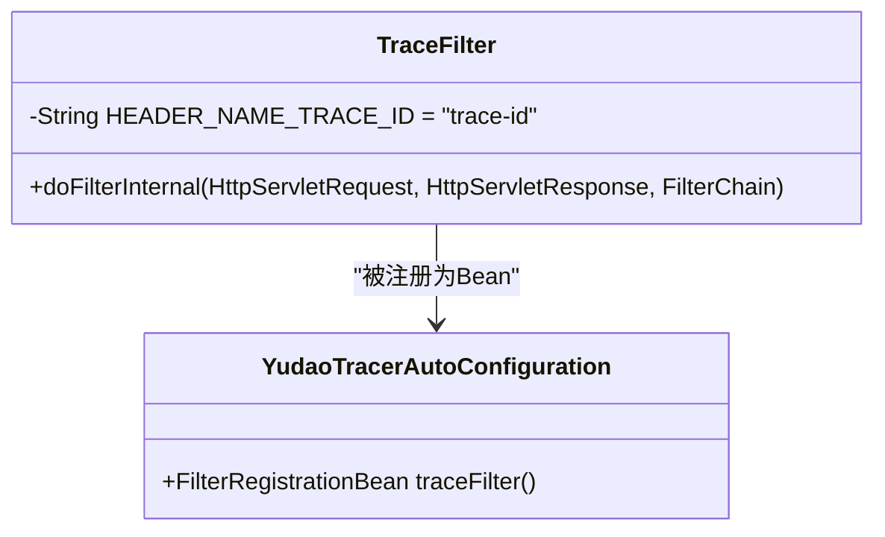
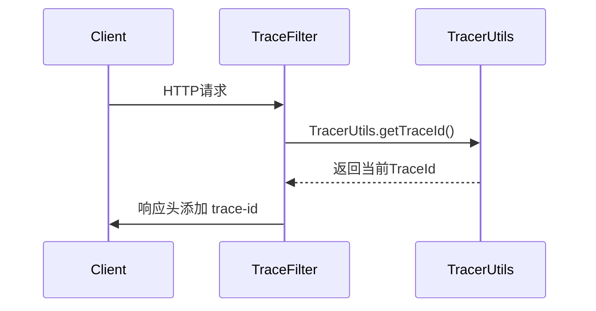
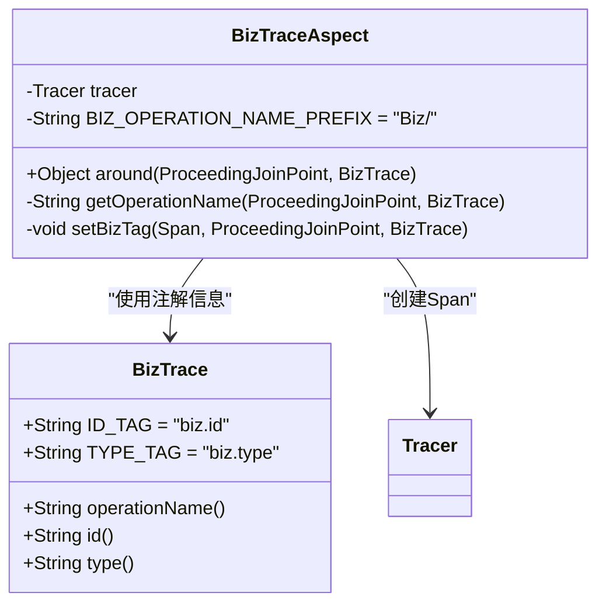
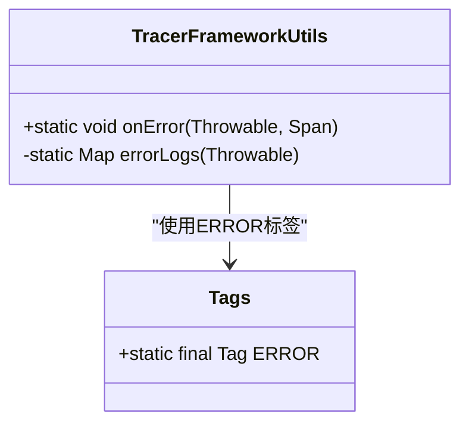

# 链路追踪

<cite>
**本文档引用文件**  
- [YudaoTracerAutoConfiguration.java](file://yudao-framework/yudao-spring-boot-starter-monitor/src/main/java/cn/iocoder/yudao/framework/tracer/config/YudaoTracerAutoConfiguration.java)
- [BizTraceAspect.java](file://yudao-framework/yudao-spring-boot-starter-monitor/src/main/java/cn/iocoder/yudao/framework/tracer/core/aop/BizTraceAspect.java)
- [BizTrace.java](file://yudao-framework/yudao-spring-boot-starter-monitor/src/main/java/cn/iocoder/yudao/framework/tracer/core/annotation/BizTrace.java)
- [TraceFilter.java](file://yudao-framework/yudao-spring-boot-starter-monitor/src/main/java/cn/iocoder/yudao/framework/tracer/core/filter/TraceFilter.java)
- [TracerFrameworkUtils.java](file://yudao-framework/yudao-spring-boot-starter-monitor/src/main/java/cn/iocoder/yudao/framework/tracer/core/util/TracerFrameworkUtils.java)
- [TracerUtils.java](file://yudao-framework/yudao-common/src/main/java/cn/iocoder/yudao/framework/common/util/monitor/TracerUtils.java)
</cite>

## 目录
1. [简介](#简介)
2. [核心组件](#核心组件)
3. [链路追踪初始化配置](#链路追踪初始化配置)
4. [TraceId生成与传递机制](#traceid生成与传递机制)
5. [BizTrace切面实现原理](#biztrace切面实现原理)
6. [TracerUtils工具类功能说明](#tracerutils工具类功能说明)
7. [跨线程与异步任务上下文传递](#跨线程与异步任务上下文传递)
8. [APM系统集成配置](#apm系统集成配置)
9. [手动埋点代码示例](#手动埋点代码示例)
10. [追踪数据采样与性能控制](#追踪数据采样与性能控制)

## 简介
本文档详细解析基于 `YudaoTracerAutoConfiguration` 的分布式链路追踪实现机制。涵盖TraceId的生成、传播、切面埋点、上下文传递、APM集成等核心功能，旨在为开发者提供完整的链路追踪技术参考。

## 核心组件
系统链路追踪功能由多个核心组件协同完成，包括自动配置类、过滤器、切面、注解和工具类，共同构建了完整的追踪体系。

**本节来源**  
- [YudaoTracerAutoConfiguration.java](file://yudao-framework/yudao-spring-boot-starter-monitor/src/main/java/cn/iocoder/yudao/framework/tracer/config/YudaoTracerAutoConfiguration.java)
- [BizTraceAspect.java](file://yudao-framework/yudao-spring-boot-starter-monitor/src/main/java/cn/iocoder/yudao/framework/tracer/core/aop/BizTraceAspect.java)
- [BizTrace.java](file://yudao-framework/yudao-spring-boot-starter-monitor/src/main/java/cn/iocoder/yudao/framework/tracer/core/annotation/BizTrace.java)

## 链路追踪初始化配置
`YudaoTracerAutoConfiguration` 是链路追踪的自动配置类，负责初始化相关组件。



**图示来源**  
- [YudaoTracerAutoConfiguration.java](file://yudao-framework/yudao-spring-boot-starter-monitor/src/main/java/cn/iocoder/yudao/framework/tracer/config/YudaoTracerAutoConfiguration.java#L16-L52)
- [TraceFilter.java](file://yudao-framework/yudao-spring-boot-starter-monitor/src/main/java/cn/iocoder/yudao/framework/tracer/core/filter/TraceFilter.java#L16-L32)

该配置类通过 `@ConditionalOnClass` 判断SkyWalking相关类是否存在，决定是否启用追踪功能，并注册 `TraceFilter` 用于在HTTP响应头中传递TraceId。

**本节来源**  
- [YudaoTracerAutoConfiguration.java](file://yudao-framework/yudao-spring-boot-starter-monitor/src/main/java/cn/iocoder/yudao/framework/tracer/config/YudaoTracerAutoConfiguration.java#L16-L52)

## TraceId生成与传递机制
系统通过 `TracerUtils` 工具类实现TraceId的生成与获取。在HTTP请求处理过程中，`TraceFilter` 过滤器会自动将当前TraceId写入响应头 `trace-id` 中，实现跨服务传递。



**图示来源**  
- [TraceFilter.java](file://yudao-framework/yudao-spring-boot-starter-monitor/src/main/java/cn/iocoder/yudao/framework/tracer/core/filter/TraceFilter.java#L16-L32)
- [TracerUtils.java](file://yudao-framework/yudao-common/src/main/java/cn/iocoder/yudao/framework/common/util/monitor/TracerUtils.java)

**本节来源**  
- [TraceFilter.java](file://yudao-framework/yudao-spring-boot-starter-monitor/src/main/java/cn/iocoder/yudao/framework/tracer/core/filter/TraceFilter.java#L16-L32)

## BizTrace切面实现原理
`BizTraceAspect` 是一个AOP切面，用于拦截标记了 `@BizTrace` 注解的方法，自动创建和结束Span。



**图示来源**  
- [BizTraceAspect.java](file://yudao-framework/yudao-spring-boot-starter-monitor/src/main/java/cn/iocoder/yudao/framework/tracer/core/aop/BizTraceAspect.java#L25-L76)
- [BizTrace.java](file://yudao-framework/yudao-spring-boot-starter-monitor/src/main/java/cn/iocoder/yudao/framework/tracer/core/annotation/BizTrace.java#L12-L41)

当方法被调用时，切面会：
1. 根据注解或方法签名生成操作名
2. 创建新的Span并启动
3. 执行原方法逻辑
4. 捕获异常并记录到Span中
5. 设置业务类型和编号tag
6. 完成Span

**本节来源**  
- [BizTraceAspect.java](file://yudao-framework/yudao-spring-boot-starter-monitor/src/main/java/cn/iocoder/yudao/framework/tracer/core/aop/BizTraceAspect.java#L25-L76)
- [BizTrace.java](file://yudao-framework/yudao-spring-boot-starter-monitor/src/main/java/cn/iocoder/yudao/framework/tracer/core/annotation/BizTrace.java#L12-L41)

## TracerUtils工具类功能说明
`TracerFrameworkUtils` 提供了链路追踪相关的工具方法，主要用于异常处理。



**图示来源**  
- [TracerFrameworkUtils.java](file://yudao-framework/yudao-spring-boot-starter-monitor/src/main/java/cn/iocoder/yudao/framework/tracer/core/util/TracerFrameworkUtils.java#L15-L45)

`onError` 方法会将异常信息记录到Span中，包括异常对象、类型、消息和堆栈信息，便于问题排查。

**本节来源**  
- [TracerFrameworkUtils.java](file://yudao-framework/yudao-spring-boot-starter-monitor/src/main/java/cn/iocoder/yudao/framework/tracer/core/util/TracerFrameworkUtils.java#L15-L45)

## 跨线程与异步任务上下文传递
系统通过OpenTracing规范的上下文传播机制，支持跨线程和异步任务的追踪上下文传递。在使用线程池或异步调用时，需确保使用支持上下文传递的执行器，或手动传递Span上下文。

（注：具体实现依赖于底层APM客户端，如SkyWalking的自动插件支持）

## APM系统集成配置
当前系统设计支持与SkyWalking等APM系统集成。需在 `application.yaml` 中配置 `yudao.tracer.enable=true`，并确保引入了SkyWalking的探针。同时，需修改SkyWalking OAP Server的 `application.yaml`，在 `SW_SEARCHABLE_TAG_KEYS` 中添加 `biz.type` 和 `biz.id` 以支持业务标签搜索。

**本节来源**  
- [YudaoTracerAutoConfiguration.java](file://yudao-framework/yudao-spring-boot-starter-monitor/src/main/java/cn/iocoder/yudao/framework/tracer/config/YudaoTracerAutoConfiguration.java#L16-L52)
- [BizTrace.java](file://yudao-framework/yudao-spring-boot-starter-monitor/src/main/java/cn/iocoder/yudao/framework/tracer/core/annotation/BizTrace.java#L12-L41)

## 手动埋点代码示例
在需要精细控制追踪范围的场景下，可使用手动埋点：

```java
// 获取当前tracer
Tracer tracer = GlobalTracer.get();
// 创建span
Span span = tracer.buildSpan("custom-operation").start();
try {
    // 业务逻辑
    span.setTag("custom.tag", "value");
} catch (Exception e) {
    TracerFrameworkUtils.onError(e, span);
    throw e;
} finally {
    span.finish();
}
```

（注：实际代码路径参考相关类的使用方式）

## 追踪数据采样与性能控制
系统通过配置 `yudao.tracer.enable` 控制追踪功能的开启与关闭。默认开启，可通过设置为false来完全关闭追踪以降低性能开销。更精细的采样策略（如采样率）依赖于底层APM系统的配置。

**本节来源**  
- [YudaoTracerAutoConfiguration.java](file://yudao-framework/yudao-spring-boot-starter-monitor/src/main/java/cn/iocoder/yudao/framework/tracer/config/YudaoTracerAutoConfiguration.java#L16-L52)