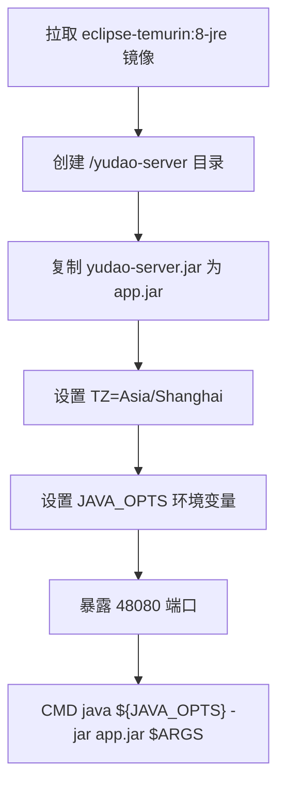
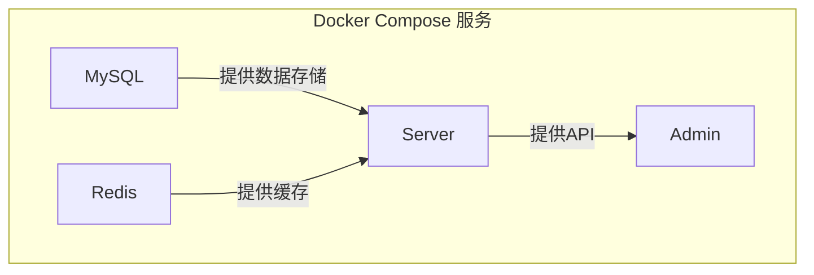
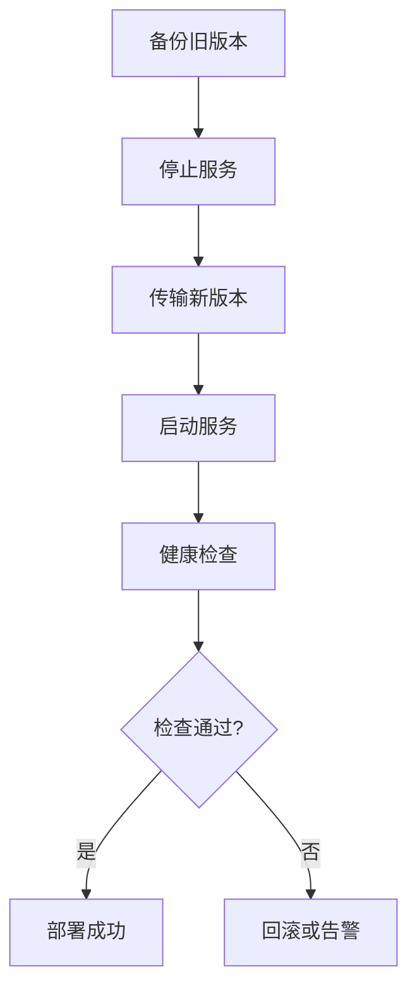

# 部署与配置

<cite>
**本文档引用的文件**  
- [application.yaml](file://yudao-server/src/main/resources/application.yaml)
- [application-dev.yaml](file://yudao-server/src/main/resources/application-dev.yaml)
- [application-local.yaml](file://yudao-server/src/main/resources/application-local.yaml)
- [Dockerfile](file://yudao-server/Dockerfile)
- [docker-compose.yml](file://script/docker/docker-compose.yml)
- [Docker-HOWTO.md](file://script/docker/Docker-HOWTO.md)
- [deploy.sh](file://script/shell/deploy.sh)
</cite>

## 目录
1. [核心配置项详解](#核心配置项详解)
2. [多环境配置管理](#多环境配置管理)
3. [Docker镜像构建](#docker镜像构建)
4. [Docker Compose编排](#docker-compose编排)
5. [集群部署与高可用](#集群部署与高可用)
6. [环境变量与敏感配置](#环境变量与敏感配置)
7. [性能调优与JVM配置](#性能调优与jvm配置)

## 核心配置项详解

### 数据库连接配置
项目通过`spring.datasource.dynamic`配置多数据源，支持主从分离。在`application-dev.yaml`和`application-local.yaml`中，配置了主库（master）和从库（slave）的连接信息，包括JDBC URL、用户名和密码。主库用于写操作，从库用于读操作，提升系统性能。

### Redis配置
Redis配置位于`spring.redis`节点下，包含host、port、database等基础连接信息。在开发环境（dev）中，Redis连接到远程服务器`400-infra.server.iocoder.cn`，而在本地环境（local）中，连接到本地`127.0.0.1`。密码配置被注释，建议在生产环境中启用。

### 消息队列配置
项目支持多种消息队列，包括RocketMQ、RabbitMQ和Kafka。
- **RocketMQ**: 通过`rocketmq.name-server`配置Name Server地址，在开发和本地环境中均指向`127.0.0.1:9876`。
- **RabbitMQ**: 在`spring.rabbitmq`中配置host、port、username和password。开发环境使用guest账号，本地环境使用rabbit账号。
- **Kafka**: 通过`spring.kafka.bootstrap-servers`配置Broker地址，指向`127.0.0.1:9092`。

### 安全配置
安全配置包含API加密、验证码和权限控制。
- **API加密**: 在`yudao.api-encrypt`中启用，使用AES算法，配置了请求和响应的密钥。
- **验证码**: 通过`aj.captcha`配置，支持滑块拼图、文字点选等类型，缓存使用Redis。
- **权限控制**: `yudao.security.permit-all_urls`配置了无需登录的公开接口，如微信公众号回调。

**Section sources**
- [application.yaml](file://yudao-server/src/main/resources/application.yaml#L109-L133)
- [application-dev.yaml](file://yudao-server/src/main/resources/application-dev.yaml#L94-L127)
- [application-local.yaml](file://yudao-server/src/main/resources/application-local.yaml#L107-L137)

## 多环境配置管理

项目采用Spring Profiles实现多环境配置，通过`application-{profile}.yaml`文件区分不同环境。
- **application.yaml**: 基础配置，适用于所有环境。
- **application-dev.yaml**: 开发环境配置，激活`dev` profile，配置开发专用的数据库、Redis和监控地址。
- **application-local.yaml**: 本地环境配置，激活`local` profile，用于开发者本地调试，配置本地数据库和Redis。

环境激活通过`spring.profiles.active`属性控制。在`application.yaml`中默认激活`local`环境，可通过命令行参数或环境变量覆盖。

**Section sources**
- [application.yaml](file://yudao-server/src/main/resources/application.yaml#L3)
- [application-dev.yaml](file://yudao-server/src/main/resources/application-dev.yaml)
- [application-local.yaml](file://yudao-server/src/main/resources/application-local.yaml)

## Docker镜像构建

### Dockerfile分析
`Dockerfile`定义了镜像构建过程：
1. 基础镜像：使用`eclipse-temurin:8-jre`作为基础镜像，替代已停止维护的AdoptOpenJDK。
2. 工作目录：创建`/yudao-server`目录并设为工作目录。
3. 文件复制：将编译好的`yudao-server.jar`复制为`app.jar`。
4. 环境变量：设置时区为`Asia/Shanghai`，配置默认JVM参数。
5. 端口暴露：暴露48080端口。
6. 启动命令：使用`java -jar`启动应用，支持通过环境变量覆盖JVM和应用参数。

**Diagram sources**
- [Dockerfile](file://yudao-server/Dockerfile)

## Docker Compose编排

`docker-compose.yml`定义了完整的服务编排，包含MySQL、Redis、Server和Admin四个服务。
- **MySQL服务**: 使用`mysql:8`镜像，端口映射3306，通过环境变量设置root密码和数据库名，挂载SQL文件实现初始化。
- **Redis服务**: 使用`redis:6-alpine`镜像，端口映射6379。
- **Server服务**: 基于`yudao-server`目录构建，暴露48080端口，依赖MySQL和Redis，通过环境变量传递数据库和Redis配置。
- **Admin服务**: 构建前端管理界面，端口映射8080，依赖Server服务。

**Diagram sources**
- [docker-compose.yml](file://script/docker/docker-compose.yml)

## 集群部署与高可用

### 定时任务集群
通过Quartz实现定时任务集群部署。在`application-dev.yaml`和`application-local.yaml`中，配置`spring.quartz.job-store-type: jdbc`，将任务信息存储在数据库中。`isClustered: true`启用集群模式，`clusterCheckinInterval: 15000`设置集群检查间隔为15秒，确保多个实例间的任务协调。

### 消息队列高可用
- **RocketMQ**: Nameserver地址配置为单点`127.0.0.1:9876`，生产环境应配置多个Nameserver实现高可用。
- **RabbitMQ**: 可通过配置多个host实现集群，当前配置为单节点。
- **Kafka**: Bootstrap servers可配置多个地址，实现Broker集群。

### 服务监控
集成Spring Boot Admin和Actuator，通过`management.endpoints.web.exposure.include: '*'`开放所有监控端点，便于系统健康检查和性能监控。

**Section sources**
- [application-dev.yaml](file://yudao-server/src/main/resources/application-dev.yaml#L138-L155)
- [application-local.yaml](file://yudao-server/src/main/resources/application-local.yaml#L138-L155)

## 环境变量与敏感配置

### 环境变量使用
在`docker-compose.yml`中大量使用环境变量，如`MYSQL_ROOT_PASSWORD`、`MASTER_DATASOURCE_URL`等，通过`${VAR_NAME:-default}`语法提供默认值。这使得配置更加灵活，便于在不同环境中覆盖。

### 敏感配置管理
敏感信息如数据库密码、API密钥等，在配置文件中使用占位符或默认值，生产环境应通过以下方式管理：
1. 环境变量注入
2. 配置中心（如Nacos、Apollo）
3. 密钥管理服务（如Vault）

在`deploy.sh`脚本中，通过`JAVA_OPTS`和`ARGS`传递JVM和应用参数，避免敏感信息硬编码。

**Section sources**
- [docker-compose.yml](file://script/docker/docker-compose.yml)
- [deploy.sh](file://script/shell/deploy.sh)

## 性能调优与JVM配置

### JVM配置
在`Dockerfile`和`deploy.sh`中配置JVM参数：
- `-Xms512m -Xmx512m`: 设置堆内存初始和最大值为512MB，避免频繁GC。
- `-Djava.security.egd=file:/dev/./urandom`: 解决Linux环境下SecureRandom导致的启动慢问题。
- `-XX:+HeapDumpOnOutOfMemoryError`: 启用OOM时堆转储，便于问题排查。

### 性能调优参数
- **数据库连接池**: Druid配置`max-active: 20`，`min-idle: 10`，平衡连接数和资源消耗。
- **Redis缓存**: `spring.cache.redis.time-to-live: 1h`，设置缓存过期时间为1小时。
- **文件上传**: `spring.servlet.multipart.max-request-size: 32MB`，限制上传大小。

### 部署脚本优化
`deploy.sh`脚本实现自动化部署，包含备份、停止、传输、启动和健康检查五个阶段。健康检查通过`curl`请求`/actuator/health`端点，确保服务正常启动后才完成部署。

**Diagram sources**
- [Dockerfile](file://yudao-server/Dockerfile)
- [deploy.sh](file://script/shell/deploy.sh)