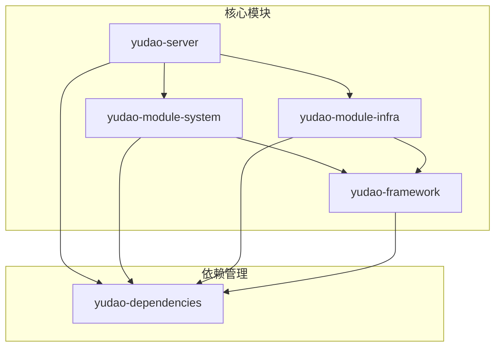
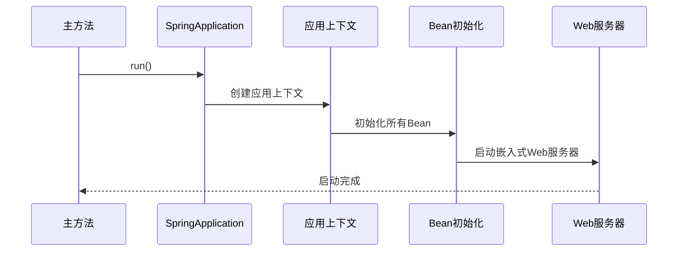
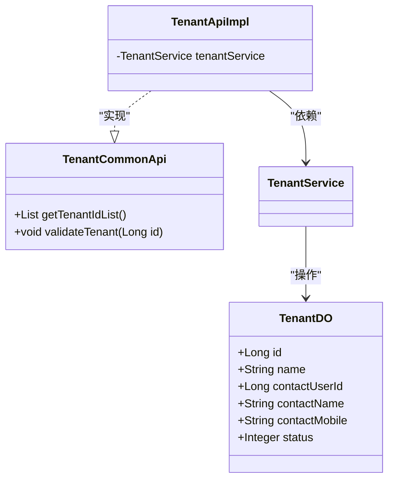

# 项目概述

<cite>
**本文档引用文件**  
- [README.md](file://README.md)
- [YudaoServerApplication.java](file://yudao-server/src/main/java/cn/iocoder/yudao/server/YudaoServerApplication.java)
- [pom.xml](file://pom.xml)
- [yudao-server/pom.xml](file://yudao-server/pom.xml)
- [yudao-module-system/pom.xml](file://yudao-module-system/pom.xml)
- [yudao-module-infra/pom.xml](file://yudao-module-infra/pom.xml)
- [TenantCommonApi.java](file://yudao-framework/yudao-common/src/main/java/cn/iocoder/yudao/framework/common/biz/system/tenant/TenantCommonApi.java)
- [TenantApiImpl.java](file://yudao-module-system/src/main/java/cn/iocoder/yudao/module/system/api/tenant/TenantApiImpl.java)
</cite>

## 目录
1. [项目简介](#项目简介)
2. [核心目标与定位](#核心目标与定位)
3. [架构设计](#架构设计)
4. [主要功能模块](#主要功能模块)
5. [模块化设计与职责划分](#模块化设计与职责划分)
6. [项目启动流程](#项目启动流程)
7. [多租户SaaS架构支持](#多租户saas架构支持)
8. [适用场景与目标用户](#适用场景与目标用户)
9. [框架对比优势](#框架对比优势)

## 项目简介

yudao-boot-mini-zt项目是一个基于Spring Boot的企业级快速开发框架，旨在为开发者提供一套完整、高效、可扩展的后端解决方案。该项目采用多模块架构设计，支持多种数据库和消息队列，集成了权限认证、代码生成、定时任务、监控等多种企业级功能。作为精简版的快速开发平台，它保留了核心系统功能和基础设施，去除了会员中心、数据报表、工作流程等可选模块，更适合中小型项目快速启动和开发。

**文档来源**
- [README.md](file://README.md)

## 核心目标与定位

yudao-boot-mini-zt项目的核心目标是为企业级应用提供一个稳定、高效、易于维护的开发框架。其定位为一个全面的Spring Boot应用骨架，支持多租户SaaS架构，适用于需要快速搭建后台管理系统的企业和开发者。项目通过模块化设计实现了功能解耦，使得开发者可以根据实际需求灵活选择和集成所需模块。该框架不仅提供了丰富的内置功能，还通过代码生成器大幅提升了开发效率，支持一键生成前后端代码、SQL脚本和接口文档。

**文档来源**
- [README.md](file://README.md)

## 架构设计

yudao-boot-mini-zt项目采用典型的多模块分层架构，主要包括以下几个核心部分：

**架构来源**
- [pom.xml](file://pom.xml)
- [yudao-server/pom.xml](file://yudao-server/pom.xml)
- [yudao-module-system/pom.xml](file://yudao-module-system/pom.xml)
- [yudao-module-infra/pom.xml](file://yudao-module-infra/pom.xml)

## 主要功能模块

项目的主要功能模块包括系统功能和基础设施两大类。系统功能模块涵盖了用户管理、角色管理、菜单管理、部门管理、岗位管理、租户管理、短信管理、邮件管理等基础功能。基础设施模块则提供了代码生成、接口文档、数据库文档、定时任务、文件服务、WebSocket、API日志、监控平台等研发工具和运维支持。这些模块共同构成了一个完整的后台管理系统，满足企业级应用的基本需求。

**文档来源**
- [README.md](file://README.md)

## 模块化设计与职责划分

yudao-boot-mini-zt项目通过模块化设计实现了功能的清晰划分和解耦。各核心模块的职责如下：

- **yudao-server**：作为主项目容器，负责整合各个模块并提供RESTful API接口
- **yudao-module-system**：实现系统核心业务功能，如用户、部门、权限等通用业务
- **yudao-module-infra**：提供基础设施和研发工具，如定时任务、代码生成器、接口文档等
- **yudao-framework**：包含各种业务组件和工具类，为上层模块提供支持

这种模块化设计使得每个模块都有明确的职责边界，便于团队协作开发和后期维护。

**文档来源**
- [yudao-server/pom.xml](file://yudao-server/pom.xml)
- [yudao-module-system/pom.xml](file://yudao-module-system/pom.xml)
- [yudao-module-infra/pom.xml](file://yudao-module-infra/pom.xml)

## 项目启动流程

项目的启动流程从YudaoServerApplication主类开始。该类使用@SpringBootApplication注解标记，通过scanBasePackages指定组件扫描的基础包路径。启动过程中，Spring Boot会自动加载配置、初始化Bean、建立数据库连接，并启动Web服务器。主类中的main方法调用SpringApplication.run()来启动应用，完成整个初始化过程。

**启动流程来源**
- [YudaoServerApplication.java](file://yudao-server/src/main/java/cn/iocoder/yudao/server/YudaoServerApplication.java)

## 多租户SaaS架构支持

yudao-boot-mini-zt项目原生支持多租户SaaS架构，通过yudao-spring-boot-starter-biz-tenant组件实现透明化的多租户底层封装。系统提供了租户管理和租户套餐功能，可以为不同租户配置独立的菜单、操作和按钮权限。多租户API接口TenantCommonApi定义了获取租户列表和校验租户合法性的方法，由TenantApiImpl实现类提供具体服务。这种设计使得系统能够轻松支持多个租户独立运行，每个租户的数据和配置相互隔离。

**多租户来源**
- [TenantCommonApi.java](file://yudao-framework/yudao-common/src/main/java/cn/iocoder/yudao/framework/common/biz/system/tenant/TenantCommonApi.java)
- [TenantApiImpl.java](file://yudao-module-system/src/main/java/cn/iocoder/yudao/module/system/api/tenant/TenantApiImpl.java)
- [sqlserver/ruoyi-vue-pro.sql](file://sql/sqlserver/ruoyi-vue-pro.sql#L10839-L10886)

## 适用场景与目标用户

yudao-boot-mini-zt项目适用于需要快速搭建企业级后台管理系统的场景，特别适合中小型企业和创业公司。目标用户包括Java后端开发者、全栈工程师以及需要快速开发管理系统的团队。该框架尤其适合那些需要支持多租户SaaS模式的应用，如SaaS服务平台、企业管理系统、CRM系统等。对于希望减少重复性工作、提高开发效率的开发者来说，这个框架提供了完整的解决方案和丰富的工具支持。

**文档来源**
- [README.md](file://README.md)

## 框架对比优势

与其他类似框架相比，yudao-boot-mini-zt具有以下显著优势：采用比Apache 2.0更宽松的MIT License开源协议，允许个人和企业100%免费使用；代码全部开源，架构设计透明，便于理解和二次开发；遵循《阿里巴巴Java开发手册》规范，代码整洁且注释详细；支持多种数据库和消息队列，具有良好的兼容性和扩展性；内置代码生成器，可一键生成前后端代码，大幅提升开发效率；提供完整的监控和运维工具，便于系统维护和性能优化。这些优势使得yudao-boot-mini-zt成为一个极具竞争力的企业级开发框架。

**文档来源**
- [README.md](file://README.md)